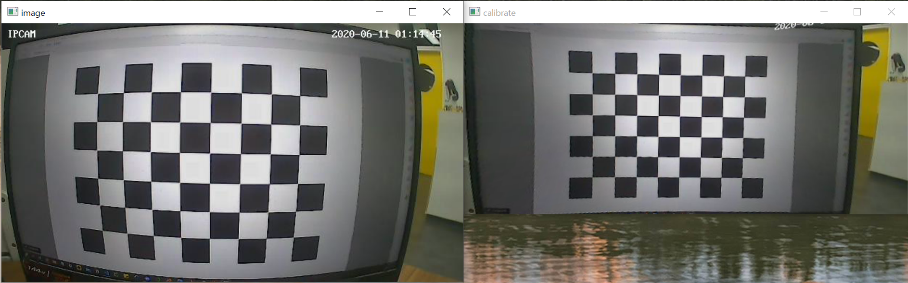

# My-Code-Collection
It's not a project, but it's a repository containing important functions that I coded.<br>
프로젝트는 아니지만, 중요한 기능을 코딩한 작업을 담은 Repository 입니다.

<br>

# Index
[Python OpenCV - Calibration](https://github.com/Lee-JaeWon/My-Code-Collection#python-opencv---calibration)<br>
[.npy file creation](https://github.com/Lee-JaeWon/My-Code-Collection#npy-file-creation)<br>
[PyQt5](https://github.com/Lee-JaeWon/My-Code-Collection#pyqt5)<br>
[Python : Scan Serial Port (COMn)]()

---
<br><br>

## 🔎Python OpenCV - Calibration
  - [Code](https://github.com/Lee-JaeWon/My-Code-Collection/blob/main/Code_py/calibration.py)
    - **calibration() Class** Method<br>
    `open_camera(cam='ip0')` : It just open a camera image(video)<br>
    `capture_camera(cam='ip0')` : If you press the keyboard c, capture it and save it in order. It is used to capture the checkerboard.<br>
    (If it's a laptop webcam, please put `0` in the `cam` parameter.)<br>
    `find_corner()` : Checkerboard detection.<br>
    `calibrate_image()` : Calibrate and display distorted images. And this method also performs numerical evaluations.<br>
    `test_image()` : Test only the given image using the generated matrix.<br>
    `calibrate_video(cam='ip0')` : Calibrate and display real-time images using the generated matrix.<br>
    <br>
    <p align="center"></p><br>
    
    If you want to start with a checkerboard capture and want all the calibration processes, you can refer to the `capture_camera(cam='ip0')`, `find_corner()`, `calibrate_image()` methods.<br><br>

## 🔎`.npy` file creation
  - [Code](https://github.com/Lee-JaeWon/My-Code-Collection/blob/main/npy_create.ipynb)<br>
  이미지 데이터 셋을 `.npy`파일 형식으로 바꾸는 코드(.ipynb 파일)<br>
  
  <br>

## 🔎PyQt5
  - Installation with pip
    ```
    pip install PyQt5
    ```
  - [Code](https://github.com/Lee-JaeWon/My-Code-Collection/blob/main/Code_py/PyQt.py)<br>
  Basic Code

<br>

## 🔎Python : Scan Serial Port (COMn)
- [Code](https://github.com/Lee-JaeWon/My-Code-Collection/blob/main/Code_py/com_port.py)<br>
  [Reference](http://daplus.net/python-python%EC%9C%BC%EB%A1%9C-%EC%82%AC%EC%9A%A9-%EA%B0%80%EB%8A%A5%ED%95%9C-com-%ED%8F%AC%ED%8A%B8-%EB%82%98%EC%97%B4/)

  ### Result
  ```
  ['COM5', 'COM9']
  ```